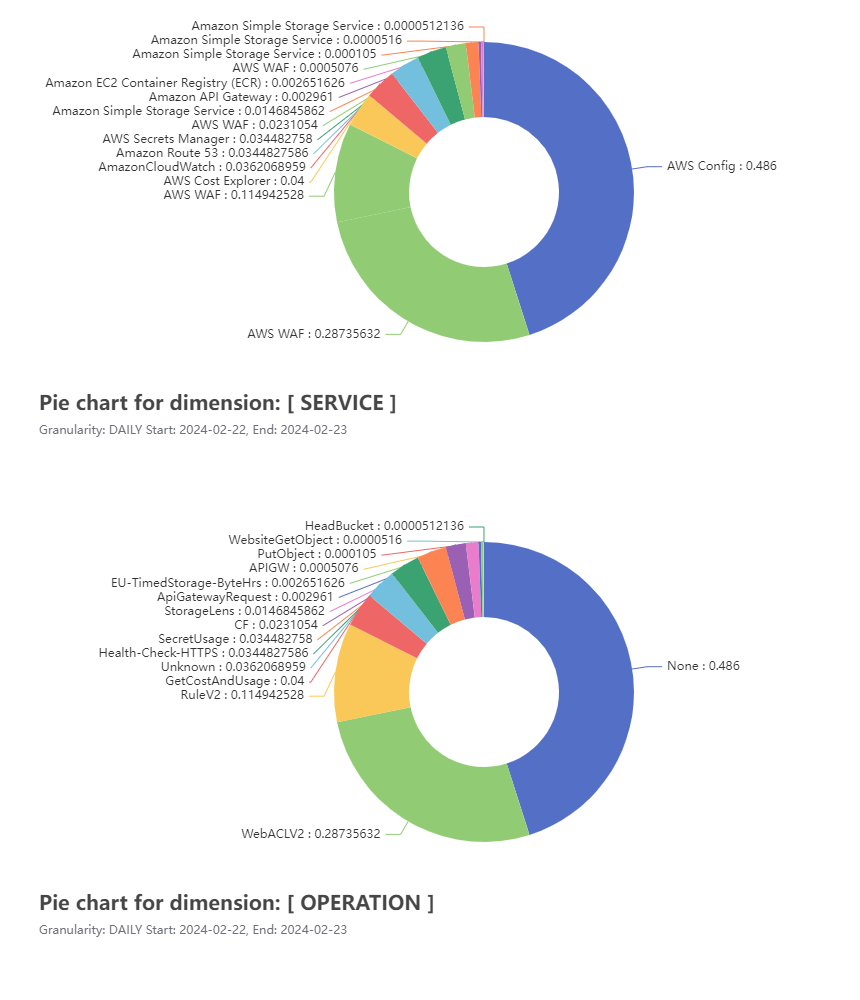

###### ccExplorer is in Alpha

<h1 align="center"><code>ccExplorer</code></h1>

<hr>
<div align="center">
<a href="https://github.com/cduggn/ccExplorer/actions" 
alt="goreleaser status">

</a>
<a href="https://goreportcard.com/report/github.com/cduggn/ccexplorer">
    
</a>
<a href="https://github.com/cduggn/ccExplorer/actions" 
alt="CodeQL status">

</a>
<a href="https://github.com/cduggn/ccExplorer/releases" 
alt="release status">

</a>
<a href="https://bestpractices.coreinfrastructure.org/projects/7276">

</a>
<br/>
</div>

`ccExplorer` (Cloud cost explorer) is a simple command line tool to explore the 
cost of your cloud resources. It's built on opensource tools like 
[aws-sdk-go-v2](https://github.com/aws/aws-sdk-go-v2), [cobra](https://github.com/spf13/cobra),
[go-echarts](https://github.com/go-echarts/go-echarts), [go-openai](https://github.com/sashabaranov/go-openai) and [go-pretty](https://github.com/jedib0t/go-pretty).
It lets you quickly surface cost and usage metrics associated with your AWS 
account and visualize them in a human-readable format like a table, csv file, 
or chart.  It was created so I could quickly explore and reason about service costs without switching context from the command line.
It's not designed as a replacement for the official AWS COST Explorer CLI 
but does provide some nice features for visualization and sorting. 

The CLI 
now supports writing cost reports to Pinecone vector database using the flag 
`-p pinecone`. The resulting index can be easily integrated with [langchain](https://github.com/tmc/langchaingo) for more interesting ways to explore 
the data. 


Installation
------------
<hr>

Build from source or download the latest release from the [releases page](https://github.com/cduggn/ccExplorer/releases).

#### From `Homebrew`

```console
$ brew tap cduggn/cduggn

$ brew install ccExplorer
```

#### From `source`:

```console
$ git clone https://github.com/cduggn/ccExplorer.git

$ cd ccExplorer 

$ go run .\cmd\ccexplorer.go get aws -g DIMENSION=SERVICE,DIMENSION=OPERATION -f SERVICE="Amazon DynamoDB"  -l -p csv
```

#### From`docker`:

```console
# download
$ docker pull ghcr.io/cduggn/ccexplorer:v0.8.3

# Container requires AWS Access key, secret, and region
$ docker run -it \
  -e AWS_ACCESS_KEY_ID=<AWS_ACCESS_KEY_ID> \
  -e AWS_SECRET_ACCESS_KEY=<AWS_SECRET_ACCESS_KEY> \
  -e AWS_REGION=<AWS-REGION> \
  --mount type=bind,source="$(pwd)"/output/,target=/app/output \
  ghcr.io/cduggn/ccexplorer:v0.8.3 get aws -g DIMENSION=OPERATION,DIMENSION=SERVICE -l
  
```

Quick Start
-----------
<hr>

#### Authentication
When you invoke a command, `ccExplorer` will use the AWS
credential chain to authenticate with AWS. Use one of the following methods when running `ccExplorer` locally..

##### AWS Profiles

```console
$ export AWS_PROFILE=profile-name
```

##### AWS Credentials

```console
$ export AWS_ACCESS_KEY_ID=access-key-id
$ export AWS_SECRET_ACCESS_KEY=secret-access-key
$ export AWS_REGION=region
```
   
##### Open AI API Key
When using the Pinecone writer you will need to set both the Open AI and Pinecone API keys. 
This is necessary to generate and upload your vector embeddings to Pinecone. You can
set the key by setting the `OPENAI_API_KEY` environment variable.
```console
$export OPENAI_API_KEY=api-key
$ export PINECONE_INDEX=pinecone-index-url ( eg. https://<index-name>>-<project-name>.svc.us-east-1-aws.pinecone.io )
$ export PINECONE_API_KEY=api-key
```

Examples
-------------

<details>
<summary>GroupBy examples</summary>

```console
# Costs grouped by LINKED_ACCOUNT 
$ ccexplorer get aws -g DIMENSION=LINKED_ACCOUNT

# Costs grouped by CommittedThroughput operation and SERVICE
$ ccexplorer get aws -g DIMENSION=OPERATION,DIMENSION=SERVICE -s 2022-10-10 -f OPERATION="CommittedThroughput" -l

# Costs grouped by CommittedThroughput and LINKED_ACCOUNT
$ ccexplorer get aws -g DIMENSION=OPERATION,DIMENSION=LINKED_ACCOUNT  -s 2022-10-10 -f OPERATION="CommittedThroughput" -l

# DynamodDB costs grouped by OPERATION
$ ccexplorer get aws -g DIMENSION=OPERATION,DIMENSION=SERVICE -s 2022-10-10 -f SERVICE="Amazon DynamoDB" -l

# All service costs grouped by SERVICE
$ ccexplorer get aws -g DIMENSION=SERVICE -s 2022-10-10

# All service costs grouped by SERVICE and OPERATION
$ ccexplorer get aws -g DIMENSION=SERVICE,DIMENSION=OPERATION -s 2022-10-01 -l

# All service costs grouped by SERVICE and OPERATION and sorted in descending order by date
$ ccexplorer get aws -g DIMENSION=SERVICE,DIMENSION=OPERATION -s 2023-01-01 -e 2023-02-10 -l -d -m DAILY

# S3 costs grouped by OPERATION 
$ ccexplorer get aws -g DIMENSION=OPERATION,DIMENSION=SERVICE -s 2022-04-04  -f SERVICE="Amazon Simple Storage Service" -l

# Costs grpuped by ApplicationName Cost Allocation Tag
$ ccexplorer get aws -g TAG=ApplicationName,DIMENSION=OPERATION -s 2022-12-10 -l

# Costs grouped by HOUR and by SERVICE and OPERATION DIMENSIONS
$ ccexplorer get aws -g DIMENSION=SERVICE,DIMENSION=OPERATION -l -e 2023-01-27T15:04:05Z -s 2023-01-26T15:04:05Z -m HOURLY

# Costs grouped by DAY and by SERVICE and OPERATION DIMEBSIONS
$ ccexplorer get aws -g DIMENSION=SERVICE,DIMENSION=OPERATION -l -e 2023-01-27 -s 2023-01-26 -m DAILY
```

</details>

<details>
<summary>Filter examples</summary>

```console
# Costs grpuped by ApplicationName Cost Allocation Tag and filtered by specific name
$ ccexplorer get aws -g TAG=ApplicationName,DIMENSION=OPERATION -s 2022-12-10 -f TAG="my-project" -l

# S3 costs grouped by SERVICE dimension and ApplicationName Cost Allocation Tag
$ ccexplorer get aws -g DIMENSION=SERVICE,TAG=ApplicationName -f SERVICE="Amazon Simple Storage Service"  -l

# S3 costs grouped by SERVICE dimension and ApplicationName Cost Allocation Tag and filtered by specific name
$ ccexplorer get aws -g DIMENSION=SERVICE,TAG=ApplicationName -f SERVICE="Amazon Simple Storage Service"  -l -f TAG="my-application"

# S3 costs grouped by SERVICE dimension and BucketName Cost Allocation Tag
$ ccexplorer get aws -g DIMENSION=SERVICE,TAG=BucketName -f SERVICE="Amazon Simple Storage Service" -l

# S3 costs grouped by SERVICE dimension and BucketName Cost Allocation Tag and filterred by specific name
$ ccexplorer get aws -g DIMENSION=OPERATION,TAG=BucketName -f SERVICE="Amazon Simple Storage Service" -l -f TAG="my-bucket"

# Costs groupedby OPERATION dimension and ApplicationName Cost Allocation Tag and filtered by PutObject operation
$ ccexplorer get aws -g TAG=ApplicationName,DIMENSION=OPERATION -s 2022-12-10 -f OPERATION="PutObject" -l

# Costs grouped by GetCostAndUsage operation and LINKED_ACCOUNT dimension
$ ccexplorer get aws -g DIMENSION=OPERATION,DIMENSION=LINKED_ACCOUNT -s 2022-12-10 -f OPERATION="GetCostAndUsage" -l
```

</details>


<details>
<summary>Target output examples</summary>

```console
# Costs exported in CSV format
$ ccexplorer get aws -g DIMENSION=LINKED_ACCOUNT,DIMENSION=OPERATION -l -m DAILY -p csv

# Costs exported to stdout
$ ccexplorer get aws -g DIMENSION=LINKED_ACCOUNT,DIMENSION=OPERATION -l -m DAILY -p stdout

# Costs grouped by MONTH by SERVICE and OPERATION and printed to chart
$ ccexplorer get aws -g DIMENSION=SERVICE, DIMENSION=OPERATION -l -e 2023-01-27 -s 2023-01-26 -m MONTHLY -p chart

# Costs grouped by MONTH by OPERATION and USAGE_TYPE and printed to chart
$ ccexplorer get aws -g DIMENSION=OPERATION,DIMENSION=USAGE_TYPE -l -e 2023-01-27 -s 2023-01-26 -m MONTHLY -p chart

# Costs grouped by MONTH by SERVICE and USAGE_TYPE and written to Pinecone index
$ ccexplorer get aws -g DIMENSION=SERVICE,DIMENSION=USAGE_TYPE -l -s 2023-02-15 -p pinecone
```

</details>

<details>
<summary>Chart example</summary>

```console
 # Generates pie chart for costs grouped by SERVICE and OPERATION over a 24 hour period
 $ ccexplorer get aws -g DIMENSION=SERVICE,DIMENSION=OPERATION -p chart -l -m DAILY  -s 2024-02-22 -e 2024-02-23
```

Generated chart:



</details>

Print Writers
-------------
The `ccExplorer` supports the following output formats: stdout, csv, chart 
and Pinecone. 

#### stdout and csv
Output to stdout and csv using the `-p stdout` and `-p csv` flags 
respectively. 

#### chart
Generates a chart using the `-p chart` flag. The chart is generated using
the [go-echarts](https://github.com/go-echarts/go-echarts) API. The 
resulting HTML file can be opened in a browser.

#### Pinecone
The Pinecone target requires the following environment variables to be set: 
- `OPENAI_API_KEY` - The API key for the OpenAI API is required to generate 
  embeddings for the Cost Explorer results.
- `PINECONE_INDEX_NAME` - The name of the Pinecone index being written to [E.g. https://<index-name>>-<project-name>>.svc.us-east-1-aws.pinecone.io ]
- `PINECONE_API_KEY` - The API key for the Pinecone API.

To reduce the possibility of sending sensitive data to OpenAI or Pinecone, the 
  `-p pinecone` flag does not support the `LINKED_ACCOUNT` dimension type.


<details>
<summary>Details of the Pinecone Metadata</summary>

When `ccExplorer` writes to Pinecone, it generates a metadata object for each row in the Cost Explorer results. The metadata object contains the following fields:
- dimensions  ( A map of the dimensions used to group the results )
- cost ( The cost of the resource )
- page_content ( The text used to generate the embeddings )
- source ( The source of the data )
- start ( The start date of the billing period )
- end ( The end date of the billing period )

</details>

System Defaults
---------------

If no cost allocation tags have been defined, the  `ccExplorer` can still be 
used to filter and group resources based on their 
AWS resource types. This can be achieved by using the group by and filter 
flags 

- If no billing period is specified, the current calendar month will be used. 
- UnblendedCost is the default cost metric. Other metrics can be specified 
  using the `-i` flag.
- `ccExplorer` prints to stdout by default. The `-p` flag can be used to 
  specify the output format (csv, chart, stdout).
- Results can be persisted to the Pinecone vector datastore using 
  the `-p  pinecone` flag. This will use OpenAI API to generate embeddings 
  and write to pinecone. 
- Results are sorted by default by cost in descending order. The `-d` flag 
  can be used to specify date sorting in descending order.
- Refunds, discounts and credits are applied automatically. The `-l` flag 
  should be used to exclude this behavior. The full list of excluded charge types is: [Credit, Refund, Discount, BundledDiscount, SavingsPlanCoveredUsage, SavingsPlanNegation]
- When filtering by cost allocation tags (`-f TAG="my-tag"`) a tag must also 
  be specified in the group by flag (`-g TAG=ApplicationName`). This 
  instructs the `ccExplorer` to filter by `ApplicationName=my-tag` .
- Hourly results can be returned by using the `-s` and `-e` flags and 
  providing an ISO 8601 formatted date and time for example `-s 
  2022-10-10T00:00:00Z -e 2022-10-10T23:59:59Z`. 
  

## Additional Information
<hr>

- Cost Explorer accesses data for the last 12 months.
- Cost Explorer charges per paginated request.
- The AWS SDK uses the default credentials provider chain.
- Credits and refunds are automatically applied to Cost Explorer results.
- Cost Explorer API calls can be tracked using CloudTrail. 
- Requests are issued against the `us-east-1` region.

## Contributing
ccexplorer is an open source project and built on the top of other open-source projects, hence we are always very happy to have contributions, whether for typo fix, bug fix or big new features. Please do not ever hesitate to ask a question or send a pull request.

We strongly value documentation and integration with other projects so we are very glad to accept improvements for these aspects.
