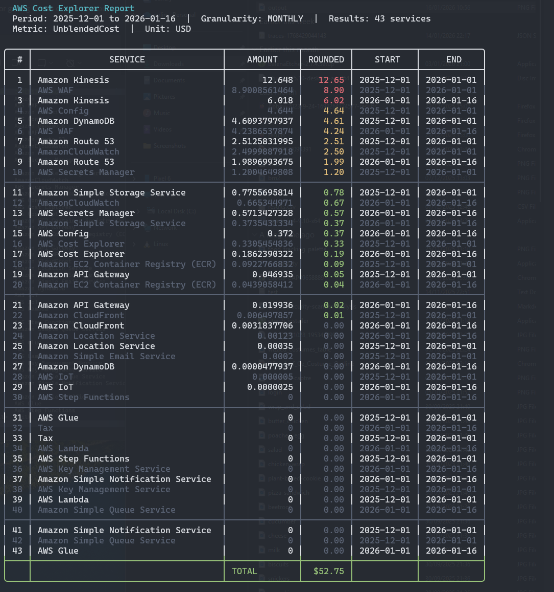

<div align="center">

# ccExplorer

**AWS Cost Explorer for the command line**

Query, filter, and visualize your AWS costs without leaving the terminal

[](https://github.com/cduggn/ccExplorer/actions)
[](https://goreportcard.com/report/github.com/cduggn/ccexplorer)
[](https://github.com/cduggn/ccExplorer/releases)



</div>

## Quick Start

```bash
brew tap cduggn/cduggn && brew install ccexplorer

# See your costs by service (current month)
ccexplorer get aws -g DIMENSION=SERVICE
```

> [!TIP]
> Credits, refunds and discounts are **included** by default. Pass `-l` to
> exclude them for accurate net cost analysis.

## Features

- **Multi-dimensional grouping** - Group costs by service, operation, account, or tags
- **Flexible filtering** - Filter by any AWS dimension or cost allocation tag
- **Multiple outputs** - Table, CSV, or charts
- **Date ranges** - Daily, monthly, or hourly granularity
- **MCP integration** - Use with GitHub Copilot and VSCode

## Installation

<details>
<summary><strong>Homebrew</strong> (recommended)</summary>

```bash
brew tap cduggn/cduggn
brew install ccexplorer
```

</details>

<details>
<summary><strong>Docker</strong></summary>

```bash
docker pull ghcr.io/cduggn/ccexplorer:latest

docker run -it \
  -e AWS_ACCESS_KEY_ID=<your-key> \
  -e AWS_SECRET_ACCESS_KEY=<your-secret> \
  -e AWS_REGION=us-east-1 \
  ghcr.io/cduggn/ccexplorer:latest get aws -g DIMENSION=SERVICE
```

</details>

<details>
<summary><strong>From source</strong></summary>

```bash
git clone https://github.com/cduggn/ccExplorer.git
cd ccExplorer
make build
./bin/ccexplorer get aws -g DIMENSION=SERVICE
```

</details>

## Usage

<details>
<summary><strong>Basic Queries</strong></summary>

```bash
# Costs by service
ccexplorer get aws -g DIMENSION=SERVICE

# Costs by service and operation
ccexplorer get aws -g DIMENSION=SERVICE,DIMENSION=OPERATION -l

# Costs by linked account
ccexplorer get aws -g DIMENSION=LINKED_ACCOUNT
```

</details>

<details>
<summary><strong>Filtering</strong></summary>

```bash
# Filter by service
ccexplorer get aws -g DIMENSION=OPERATION,DIMENSION=SERVICE -f SERVICE="Amazon DynamoDB" -l

# Filter by operation
ccexplorer get aws -g DIMENSION=OPERATION,DIMENSION=SERVICE -f OPERATION="GetCostAndUsage" -l

# Filter by cost allocation tag
ccexplorer get aws -g TAG=ApplicationName,DIMENSION=OPERATION -f TAG="my-project" -l
```

</details>

<details>
<summary><strong>Date Ranges & Granularity</strong></summary>

```bash
# Custom date range
ccexplorer get aws -g DIMENSION=SERVICE -s 2024-01-01 -e 2024-01-31

# Daily granularity
ccexplorer get aws -g DIMENSION=SERVICE,DIMENSION=OPERATION -m DAILY -s 2024-01-01 -e 2024-01-07

# Hourly granularity (requires ISO 8601 timestamps)
ccexplorer get aws -g DIMENSION=SERVICE -m HOURLY -s 2024-01-01T00:00:00Z -e 2024-01-02T00:00:00Z
```

</details>

<details>
<summary><strong>Output Formats</strong></summary>

```bash
# CSV export
ccexplorer get aws -g DIMENSION=SERVICE -p csv

# Chart (generates HTML file)
ccexplorer get aws -g DIMENSION=SERVICE,DIMENSION=OPERATION -p chart -l
```

</details>

## Configuration

### AWS Authentication

ccExplorer uses the standard AWS credential chain. Set one of:

```bash
# Option 1: AWS Profile
export AWS_PROFILE=your-profile

# Option 2: Access keys
export AWS_ACCESS_KEY_ID=your-key
export AWS_SECRET_ACCESS_KEY=your-secret
export AWS_REGION=us-east-1
```

## Advanced Features

<details>
<summary><strong>MCP Server Integration</strong></summary>

ccExplorer includes a built-in MCP server for AI-powered cost analysis through VSCode and GitHub Copilot.

**Setup:**
1. Add `"chat.mcp.enabled": true` to VSCode settings
2. Build ccExplorer: `make build`
3. Use with Copilot Chat in Agent Mode

**Example queries:**
```
@agent What were my AWS costs for the last 30 days grouped by service?
@agent Show my EC2 costs for the last quarter, excluding discounts
```

See [VSCode MCP Integration Guide](./docs/vscode-mcp-integration.md) for details.

</details>

<details>
<summary><strong>System Defaults</strong></summary>

| Setting | Default |
|---------|---------|
| Date range | First day of the previous month to today |
| Cost metric | UnblendedCost |
| Output | stdout (table) |
| Sort order | Cost descending |
| Excluded charges | None; pass `-l` to exclude credits, refunds and discounts |

</details>

## Development

```bash
make build       # Build to bin/
make test        # Run tests
make lint        # Run linter
make release     # Create release with goreleaser
```

## Contributing

Contributions welcome! We value bug fixes, documentation improvements, and new features.

This project uses [Conventional Commits](https://www.conventionalcommits.org/).

[](https://github.com/cduggn/ccExplorer/actions/workflows/codeql.yml)
[](https://bestpractices.coreinfrastructure.org/projects/7276)

## License

[MIT](LICENSE)
